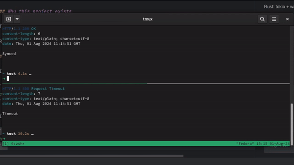

# Cloud Sync

Small web service with one endpoint: /wait-for-second-party/:unique-id

This endpoint allows two parties to sync.
When one party makes a POST request, the response will be delayed until the second party requests the same URL. In other
words, the first party is blocked until the second party arrives or a timeout occurs (let it be 10 seconds).

Rust: tokio + warp

## Why this project exists

This is project presenting simple stateful api written in Rust created for educational purposes.

Reading this code you can learn how to create server in rust and write tests for it.

## How to run

In first console start server:

```bash
cargo run
```

In second and third console experiment with http requests like:

```bash
http POST http://127.0.0.1:3030/wait-for-second-party/test-id
```

to obtain responses

```http response
HTTP/1.1 200 OK
content-length: 6
content-type: text/plain; charset=utf-8

Synced
```

or

```http response
HTTP/1.1 408 Request Timeout
content-length: 7
content-type: text/plain; charset=utf-8

Timeout
```

You should be able to reproduce steps from demo presented below



Firstly two request was send, we have seen that first was hanging until second arrived.
Then we send two request with different ids, and both was hanging until third arrived.
Finally last request was ended after 10 seconds by timeout.

## Deep dive into codebase

We decided to use `tokio` and `warp`. Tokio provides async runtime environment.
Warp is library allowing to set up web server build on top of tokio.
It is equivalent of express from node, or flask from python.

We're starting from setting state of app. It will be a map with keys
being strings from user, and values being senders from tokio oneshot channel.

```rust
let state = Arc::new(Mutex::new(HashMap::new()));
```

To pass it with id chosen by user to function `handle_sync` we're defining route by

```rust
let sync_route = warp::path!("wait-for-second-party" / String)
.and(state_filter.clone())
.and(warp::post())
.and_then(handle_sync);
```

finally we are exposing server on 3000 port

```rust
warp::serve(sync_route).run(([127, 0, 0, 1], 3030)).await;
```

To sum up our `main` looks like below

```rust
#[tokio::main]
async fn main() {
    let state = Arc::new(Mutex::new(HashMap::new()));
    let state_filter = warp::any().map(move || Arc::clone(&state));

    let sync_route = warp::path!("wait-for-second-party" / String)
        .and(state_filter.clone())
        .and(warp::post())
        .and_then(handle_sync);

    warp::serve(sync_route).run(([127, 0, 0, 1], 3030)).await;
}
```

Now let's discuss `handle_sync` function that is called every time, when proper request was cough by server

```rust
async fn handle_sync(
    unique_id: String,
    state: Arc<Mutex<HashMap<String, tokio::sync::oneshot::Sender<()>>>>,
) -> Result<impl warp::Reply, warp::Rejection> {
    let (tx, rx) = tokio::sync::oneshot::channel();

    {
        let mut state_lock = state.lock().unwrap();
        if let Some(tx_existing) = state_lock.remove(&unique_id) {
            tx_existing.send(()).unwrap_or_default();
            return Ok(warp::reply::with_status("Synced", warp::http::StatusCode::OK));
        } else {
            state_lock.insert(unique_id.clone(), tx);
        }
    }

    let timeout = tokio::time::sleep(Duration::from_secs(10));
    tokio::select! {
        _ = rx => {
            Ok(warp::reply::with_status("Synced", warp::http::StatusCode::OK))
        },
        _ = timeout => {
            let mut state_lock = state.lock().unwrap();
            state_lock.remove(&unique_id);
            Ok(warp::reply::with_status("Timeout", warp::http::StatusCode::REQUEST_TIMEOUT))
        },
    }
}
```

We need there do two things:
a) modify state
b) communicate with other waiting handlers

To communicate we are using `oneshot::channel`. You can read about it more
here https://docs.rs/tokio/latest/tokio/sync/oneshot/fn.channel.html

in line

```rust
let (tx, rx) = tokio::sync::oneshot::channel();
```

we are obtaining access to `Sender` (tx) and `Receiver` (rx)

Now we are locking state to avoid race conditions.

```rust
let mut state_lock = state.lock().unwrap();
```

and there are two scenarios

1) we already send request with this id.
2) it is our first request

Lets start from second option. Then in code:

```rust
if let Some(tx_existing) = state_lock.remove( & unique_id) {
tx_existing.send(()).unwrap_or_default();
return Ok(warp::reply::with_status("Synced", warp::http::StatusCode::OK));
} else {
state_lock.insert(unique_id.clone(), tx);
}
```

we will insert to state `tx` what is sender. Thanks to this,
we can call send on it any time it will be found by another
request from user that will try to sync.

But it is not the end.

During firs request we're adding timeout by

```rust
let timeout = tokio::time::sleep(Duration::from_secs(10));
```

that can be potentially interrupted by `rx` attached to mentioned `tx`

```rust
tokio::select! {
    _ = rx => {
        Ok(warp::reply::with_status("Synced", warp::http::StatusCode::OK))
    },
    _ = timeout => {
        let mut state_lock = state.lock().unwrap();
        state_lock.remove(&unique_id);
        Ok(warp::reply::with_status("Timeout", warp::http::StatusCode::REQUEST_TIMEOUT))
    },
}
```

There are two possibility to finish this hanging request.

a) by timeout
b) by rx that will see that on associated tx was called `send`.

So now let's imagine that first request was called so we have hanging request before timeout.

If second request with the same id would be sent then instead of

```rust
state_lock.insert(unique_id.clone(), tx);
```

we will execute

```rust
tx_existing.send(()).unwrap_or_default();
return Ok(warp::reply::with_status("Synced", warp::http::StatusCode::OK));
```

so not only second request will get `Synced` response, but first hanging will
timeout will be interrupted by `rx` function associated with his `tx`.

so we will end first request with `Synced` from:

```rust
_ = rx => {
Ok(warp::reply::with_status("Synced", warp::http::StatusCode::OK))
},
```

In other way if second request will not appear then reason of finish for first request will be

```rust
let timeout = tokio::time::sleep(Duration::from_secs(10));
```

We explained how code of our service works with details.

## Tests

Code can be tested by

```
cargo test
```

It takes 11 seconds because of timeout.
To fix it we had to override service with timeout by custom code that behaves differently during tests or configure
timeout to be dependent from runtime mode.

